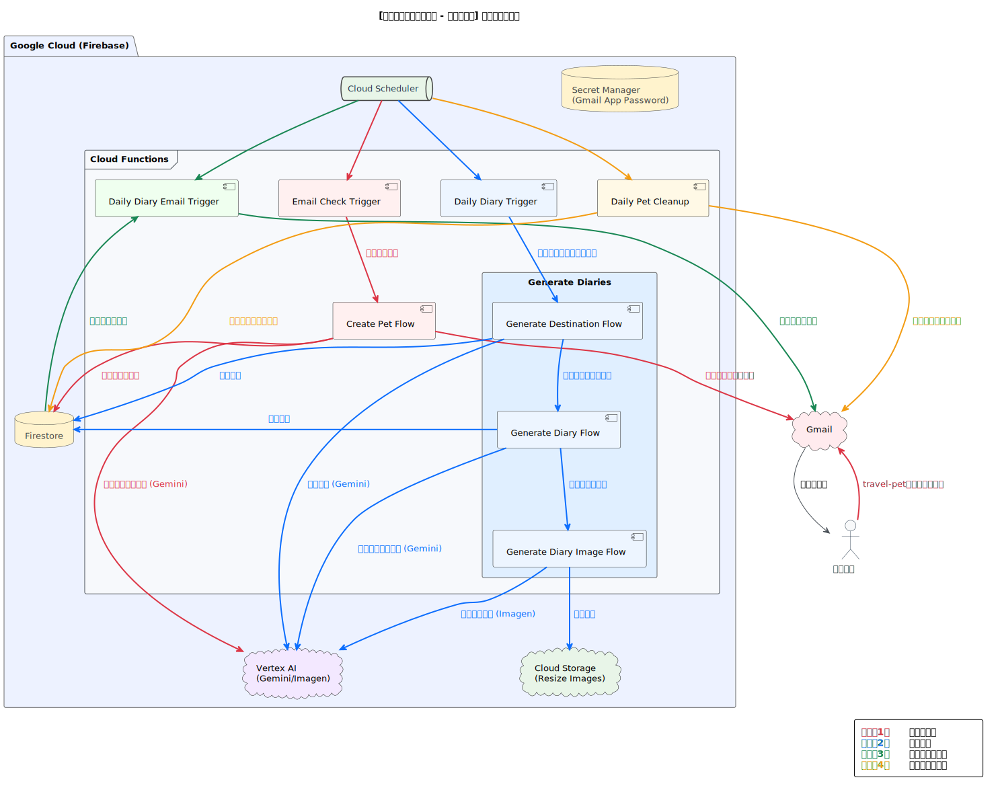

# Travel Pet - 旅するデジタルペット「たびぺっち」

あなたのメールに届く、ちいさな世界の旅。

知らない世界に、出会ってみませんか？

「たびぺっち」は、あなたのもとに毎日1通、小さな旅日記を届けるデジタルペットです。
ペットは気まぐれに世界を巡り、観光地だけでなく、誰も知らない村や、その日に話題になった遠い国の出来事、静かな港町の朝など、思いもよらない景色や物語をメールで教えてくれます。

日々の情報が自分好みに並ぶ時代だからこそ、
「たびぺっち」は、あなたが普段出会えない場所・文化・出来事を、“ゆるいノイズ”としてそっと届けます。
見慣れた毎日に、ちょっとだけ新しい視点と驚きを。
忙しいあなたの心に、小さな冒険と癒しを。

さあ、メールボックスで世界を旅する日々をはじめましょう。

## ✨ 概要

ユーザーが指定のメールアドレスにメールを送ると、そのユーザーだけのユニークなペットが生成されます。以降、そのペットが世界中を旅して、毎日AIが生成した絵日記をメールで送信します。

## 🚀 技術的ハイライト

本プロジェクトでは、AI中心のアプリケーションを迅速に開発・運用するため、以下の技術を採用しています。

### 1. Genkit: AIネイティブな開発フレームワーク
Google製のGenkitフレームワークを全面的に採用し、AIフローの定義、ローカルでのテスト、本番環境へのデプロイを効率化しています。

- **宣言的なフロー定義**: ペットの生成、目的地の決定、日記の作成といった一連のAI処理を、TypeScriptで記述された `flow` として管理しています。これにより、複雑な処理の見通しが良くなり、メンテナンス性が向上します。
- **ローカル開発UI**: `genkit start` を実行することで、ローカル環境でフローの動作確認やデバッグが可能です。入力データをGUIから与え、実行結果やトレース情報をリアルタイムで確認できます。
- **プロンプト管理**: `.prompt` ファイルとしてプロンプトを外部管理することで、コードとプロンプトを分離し、非エンジニアでもプロンプトの改善・更新が容易になります。

### 2. マルチモーダルなAI活用
Googleの強力なAIモデルを組み合わせ、リッチなユーザー体験を実現しています。

- **Gemini**: ペットのプロフィールや、旅先での出来事を綴った日記の文章を生成します。`dotprompt` 形式で記述されたプロンプトテンプレートと連携し、動的で創造的なテキストを生成します。
- **Imagen**: 日記の文章に合わせて、その日の思い出を表現した画像を生成します。これにより、ユーザーはペットの旅をより鮮明にイメージできます。

### 3. サーバーレス・アーキテクチャ
Firebaseを中心としたサーバーレス構成により、スケーラビリティとメンテナンス性に優れたシステムを構築しています。

- **Firebase Cloud Functions (v2)**: メールの受信をトリガーに、ペット生成や日記作成のフローを実行します。イベント駆動でコードが実行されるため、リソースを効率的に活用できます。
- **Firestore**: ペットのプロフィールや過去の日記データを格納するデータベースとして利用しています。
- **Cloud Storage for Firebase**: Imagenが生成した画像を保存し、メールに添付する際に利用します。
- **Firebase Extensions (Resize Images)**: Imagenで生成された画像は容量が大きいため、Cloud Storageに保存された後、Firebase Extensionの「Resize Images」を利用して自動的に適切なサイズにリサイズされます。これにより、メール送信時のデータ量を削減し、ユーザー体験を向上させています。
- **Google Cloud Scheduler**: 毎日定時に日記生成フローをトリガーし、全ユーザーに日記を送信します。
- **Google Cloud Secret Manager**: Gmailのアプリパスワードなどの機密情報を安全に管理しています。
- **Firebase Hosting**: 簡易なデモサイトをホスティングし、ペットと日記の生成の動作確認を行えるインターフェースを提供しています。

### 4. メール駆動のユニークなUX
ユーザーはメールを送るだけでサービスを利用開始できます。このシンプルな体験の裏側では、以下の技術が連携しています。

- **IMAP/Nodemailer**: 特定のメールエイリアス（`+travel-pet`）へのメールをIMAPで定期的に監視し、新規ユーザーを検知します。日記の送信にはNodemailerを利用しています。

## 📊 システム構成図




## 🛠️ セットアップと実行方法

### 前提条件
Firebaseプロジェクトの設定はできているものとします。

### Gmailアプリパスワードの取得
このプロジェクトでは、IMAP/Nodemailerによるメールの送受信にGmailアカウントを使用します。
**アプリパスワード**を取得して`EMAIL_APP_PASSWORD`に設定する必要があります。

### 1. 環境構築
```bash
# 1. リポジトリをクローン
git clone https://github.com/enu-kuro/travel-pet.git
cd travel-pet/functions

# 2. 依存関係をインストール
npm install
```

### 2. 環境変数の設定
Firebase Secret Managerに必要な情報を設定します。

- `EMAIL_ADDRESS`: Gmailのベースアドレス (例: `user@gmail.com`)
- `EMAIL_APP_PASSWORD`: Gmailのアプリパスワード

`.secret.local` ファイルをプロジェクトルートに作成し、ローカル開発用に同じ値を設定することも可能です。

### 3. ローカルでの開発
Genkitの開発UIを起動し、各フローを個別にテストできます。

```bash
# functionsディレクトリで実行
npm run genkit:start
```
ブラウザで `http://localhost:4000` を開くと、GenkitのUIが表示されます。ここから各フローを選択し、JSON形式で入力を与えて実行結果を確認できます。

### 4. 動作確認（Firebaseエミュレータ）
Cloud FunctionsとFirestoreをローカルでエミュレートして、全体の動作を確認します。

```bash
# functionsディレクトリで実行
npm run serve
```

### 5. デプロイ
Firebaseにファンクションをデプロイします。

```bash
# functionsディレクトリで実行
npm run deploy
```

### 6. デモサイト
ローカルエミュレータを起動すると、`public/index.html` の簡易インターフェースから
ペット生成〜日記生成までのフローを試せます。

```bash
# プロジェクトルートで実行
npm run serve
```
ブラウザで `http://localhost:5005` を開くとデモ画面が表示され、ボタン一つで各フロー
が順番に実行されます。生成されたペット情報・旅先・日記・画像が画面に表示されます。

## 📜 主な処理フロー

1.  **ペットの誕生 ([`emailCheckTrigger`](functions/src/index.ts#L14-L28))**:
    - ユーザーが `your-email+travel-pet@gmail.com` にメールを送信。
    - Cloud Schedulerで`emailCheckTrigger`をトリガーすることで、IMAPでメールを定期的に検知。（10分間隔）
    - [`createPetFlow`](functions/src/flows/createPetFlow.ts) が実行され、Geminiがペットのプロフィールを生成。
    - Firestoreにペットのデータが保存される。
    - `配信停止`もここで同時に検知し、ペットデータを削除。

2.  **日記の生成 ([`dailyDiaryTrigger`](functions/src/index.ts#L30-L44))**:
    - 毎日、Cloud Schedulerがこのフローをトリガー。（午前5時30分）
    - [`generateDiariesForAllPets`](functions/src/diaryService.ts#L15-L67) が実行され、各ペットに対して以下の処理を行う:
        - [`generateDestinationFlow`](functions/src/flows/generateDestinationFlow.ts) でGeminiがランダムな旅先を生成。
        - [`generateDiaryFlow`](functions/src/flows/generateDiaryFlow.ts) でGeminiが日記の文章を、[`generateDiaryImageFlow`](functions/src/flows/generateDiaryImageFlow.ts)でImagenが画像を生成。
    - 生成された日記データはFirestoreに保存される。

3.  **日記のメール送信 ([`dailyDiaryEmailTrigger`](functions/src/index.ts#L46-L60))**:
    - 毎日、Cloud Schedulerがこのフローをトリガー。（午前6時00分）
    - [`sendDiaryEmailsForAllPets`](functions/src/diaryService.ts#L71-L112) が実行され、生成された日記をNodemailer経由でユーザーにメール送信する。

4.  **ペットのクリーンアップ ([`dailyPetCleanup`](functions/src/index.ts#L62-L75))**:
    - 毎日、Cloud Schedulerがこのフローをトリガー。（午前3時30分）
    - [`deleteExpiredPets`](functions/src/petService.ts#L46-L74) が実行され、寿命に達したペットデータを削除する。
